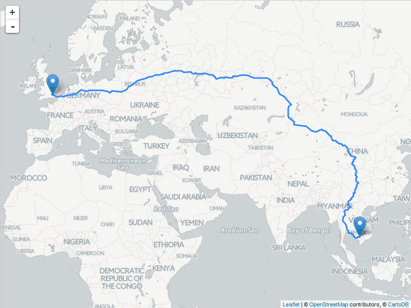
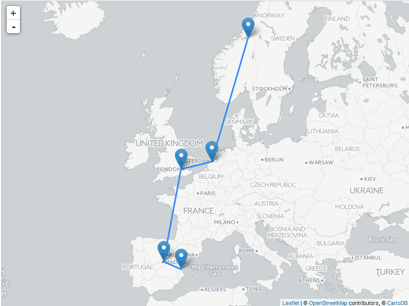

# Leaflet.Polyline.SnakeAnim

A plugin for [LeafletJS](http://www.leafletjs.com) to make polylines animate into existence.




Animation is time- and distance- based: the more time elapsed into the animation,
the longer the visible length of the polyline.

Also works on layer groups:



Current version works only with Leaflet 1.1 or higher.

### API

New method in both `L.Polyline` and `L.LayerGroup`: `snakeIn()`. Call it to
trigger the animation.

New option in `L.Polyline`: `snakingSpeed`. This is the speed of the animation,
in pixels per second. Pixels refer to the length of the polyline at the current
zoom level. The default value is 200.

New option in `L.LayerGroup`: `snakingPause`. This is the number of milliseconds
to wait between layers in the group when doing a snaking animation.

```js
var line = L.polyline(latlngs, {snakingSpeed: 200});
line.addTo(map).snakeIn();
```

```js
var route = L.layerGroup([
	L.marker(airport1),
	L.polyline([airport1, airport2]),
	L.marker(airport2)
], { snakingPause: 200 });
route.addTo(map).snakeIn();
```

When a polyline or layer group is performing the snaking animation, it will
fire `snakestart`, `snake` and `snakeend` events.

### Legalese


"THE BEER-WARE LICENSE":
<ivan@sanchezortega.es> wrote this file. As long as you retain this notice you
can do whatever you want with this stuff. If we meet some day, and you think
this stuff is worth it, you can buy me a beer in return.


